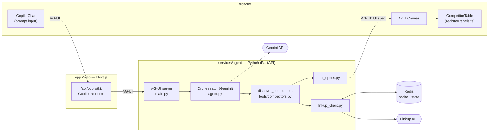
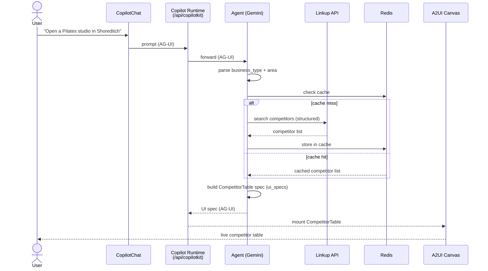

# VantageAI — Architecture (MVP)

Two views: the **component architecture** (what runs where) and the **user flow** (what happens when someone asks a question).

---

## 1. Component architecture

**Pieces**
- **Browser** — `CopilotChat` for input; the **A2UI canvas** mounts React panels (`CompetitorTable`) by name via `lib/registerPanels.ts`.
- **apps/web** — Next.js app; `/api/copilotkit` runs the **Copilot Runtime**, which bridges the browser to the agent over **AG-UI**.
- **services/agent** — Python FastAPI **AG-UI server**; the Gemini **orchestrator** calls the `discover_competitors` tool, which uses `linkup_client` (Redis-cached) and builds an A2UI panel spec via `ui_specs`.
- **External** — **Linkup** (web search), **Gemini** (reasoning), **Redis** (cache + shared state).

---

## 2. User flow

**Flow**
1. User types one sentence into **CopilotChat**.
2. The **Copilot Runtime** forwards it to the agent over **AG-UI**.
3. The agent extracts `business_type` + `area`, checks **Redis**, and on a miss queries **Linkup** for competitors (caching the result).
4. The agent builds a **`CompetitorTable`** A2UI spec and emits it back over AG-UI.
5. The **A2UI canvas** mounts the panel with the data — the user sees a live competitor table.

See [`README.md`](../README.md) for stack and quickstart.
